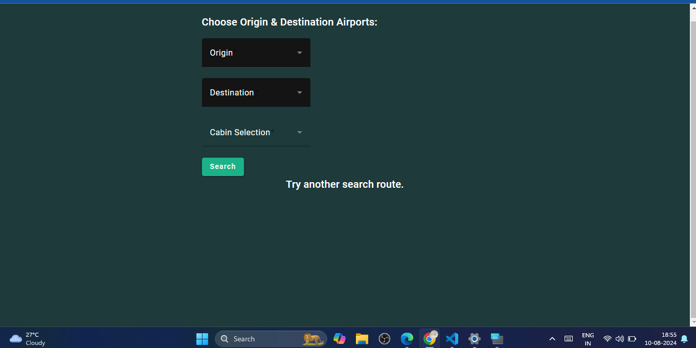
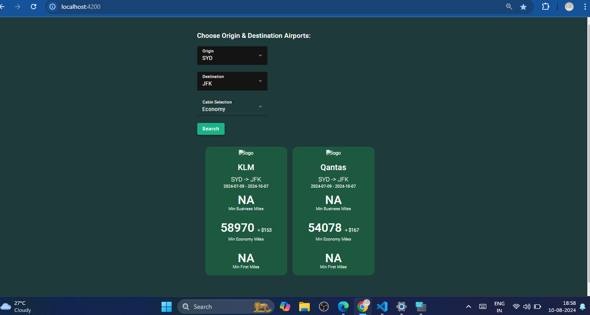

# Live app

https://bayesian-technologies-assignment-by-p.netlify.app/

#### live screenshot 1

<div style="border: 2px solid skyblue">

</div>

#### live screenshot 2

<div style="border: 2px solid skyblue">

</div>

## start frontend dev

```
cd  frontend
```

#### install all dependencies

```
npm i --legacy-peer-deps
```

#### change environment in following file

##### frontend/environment/environment.ts

#### run frontend on local

```
ng serve
```

---

## start backend dev

```
cd  backend
```

#### create virtual environment

```
pipenv shell
```

#### install all dependencies

```
pip install -r requirements.txt
```

#### run backend on local

```
python app.py
```
